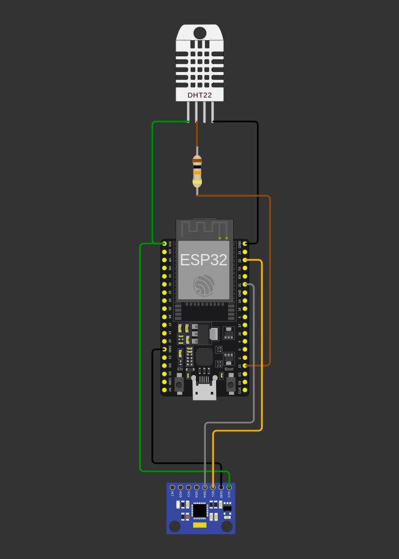
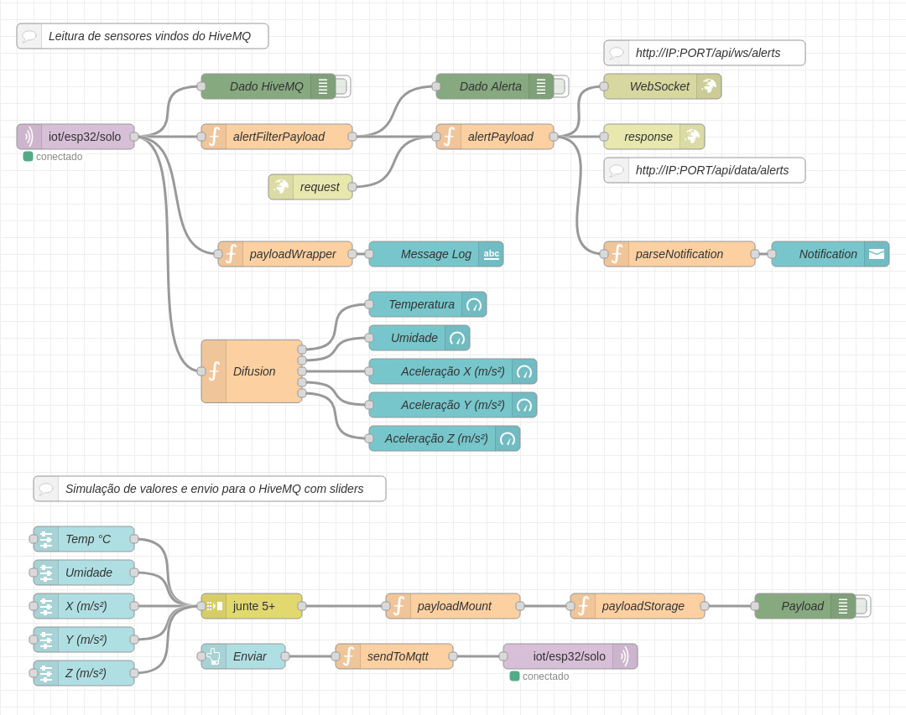
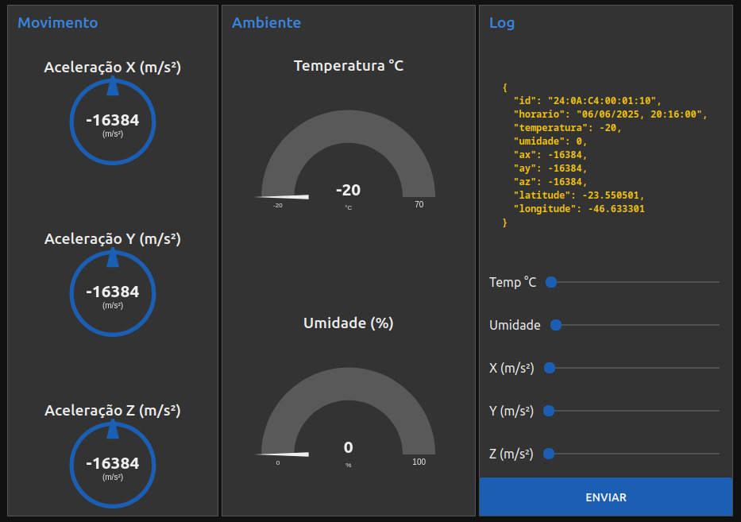
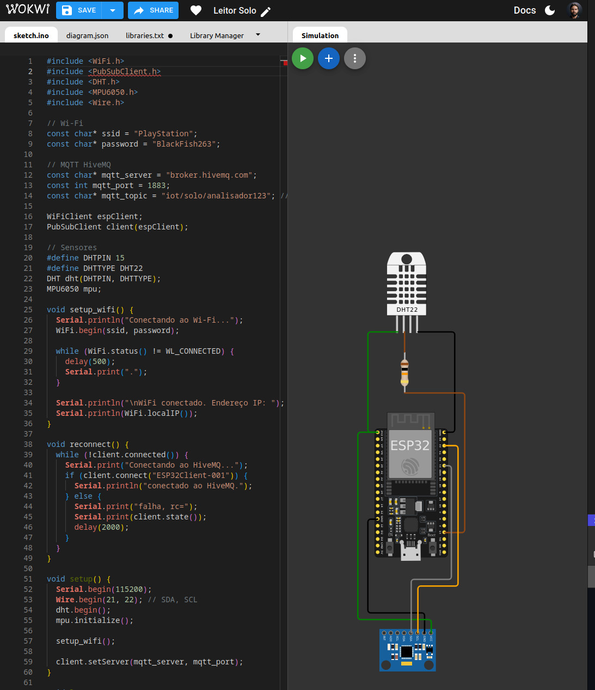

# 🚨 Sistema de Alertas IoT com ESP32

Um sistema inteligente de monitoramento ambiental e de movimento que utiliza sensores conectados ao ESP32 para emitir alertas baseados em condições específicas dos dados coletados.

## 📋 Índice

- [Sobre o Projeto](#-sobre-o-projeto)
- [Video de desmonstração](#-video-de-demostração)
- [Funcionalidades](#-funcionalidades)
- [Tecnologias Utilizadas](#-tecnologias-utilizadas)
- [Hardware Necessário](#-hardware-necessário)
- [Configuração do Ambiente](#️-configuração-do-ambiente)
- [Instalação](#-instalação)
- [Como Usar](#-como-usar)
- [Estrutura do Projeto](#-estrutura-do-projeto)
- [Simulação](#-simulação)
- [Contribuição](#-contribuição)
- [Licença](#-licença)
- [Desenvolvedores](#-desenvolvedores)
- [Links Úteis](#-links-úteis)

## 🎯 Sobre o Projeto

Este projeto implementa um sistema de monitoramento IoT que coleta dados ambientais (temperatura e umidade) através do sensor DHT22 e dados de movimento/aceleração através do sensor MPU6050. Com base nas leituras desses sensores, o sistema é capaz de:

- Visualizar dados através de dashboard web
- Identificar movimentos ou vibrações anômalas
- Detectar variações críticas de temperatura e umidade
- Enviar alertas em tempo real através de diferentes canais

## 📺 Video de Demostração

#### Link do [YouTube](https://youtu.be/NsYGkFWhY1s)

## ⚡ Funcionalidades

- ✅ **Dashboard Web**: Interface visual para monitoramento em tempo real
- ✅ **Conectividade WiFi**: Transmissão de dados via WiFi integrado do esp32
- ✅ **Múltiplos Canais de Alerta**: Notificações via protocolo htpp ou websocket
- ✅ **Monitoramento Contínuo**: Leitura constante dos sensores DHT22 e MPU6050
- ✅ **Alertas Inteligentes**: Sistema de notificações baseado em thresholds configuráveis

## 🛠 Tecnologias Utilizadas

### Hardware & Firmware
- **C++** - Linguagem de programação
- **[ESP32](https://www.espressif.com/en/products/socs/esp32)** - Microcontrolador principal
- **[DHT22](https://www.adafruit.com/product/385)** - Sensor de temperatura e umidade
- **[MPU6050](https://invensense.tdk.com/products/motion-tracking/6-axis/mpu-6050/)** - Sensor de movimento e aceleração
- **[PlatformIO](https://platformio.org/)** - IDE e gerenciador de bibliotecas

### Simulação & Desenvolvimento
- **[Wokwi](https://wokwi.com/)** - Simulador online para ESP32
- **[Node-RED](https://nodered.org/)** - Plataforma de automação e dashboard

### Bibliotecas Principais
```cpp
#include <WiFi.h>
#include <DHT.h>
#include <MPU6050.h>
#include <ArduinoJson.h>
#include <PubSubClient.h>
```

## 🔧 Hardware Necessário

| Componente | Quantidade | Descrição |
|------------|------------|-----------|
| ESP32 DevKit | 1x | Microcontrolador principal |
| DHT22 | 1x | Sensor de temperatura e umidade |
| MPU6050 | 1x | Sensor de movimento 6 eixos |
| Resistor 10kΩ | 1x | Pull-up para DHT22 |
| Jumpers | 8x | Conexões |

### Esquema de Ligação

<div align="center" style="height: 400px">
    
</div>

| ESP32 Pin | Componente | Descrição |
|-----------|------------|-----------|
| GPIO4 | DHT22 Data | Dados do sensor DHT22 |
| GPIO21 | MPU6050 SDA | Comunicação I2C |
| GPIO22 | MPU6050 SCL | Clock I2C |
| 3.3V | VCC Sensores | Alimentação |
| GND | GND Sensores | Terra |

## ⚙️ Configuração do Ambiente

### 1. Instale o PlatformIO

**Via VS Code:**
```bash
# Instale a extensão PlatformIO IDE no VS Code
```

**Via CLI:**
```bash
pip install platformio
```

### 2. Clone o Repositório
```bash
git clone https://github.com/seu-usuario/iot-alert-system.git
cd iot-alert-system
```


## 🚀 Instalação

### 1. Compile e Faça Upload
```bash
# No diretório do projeto
pio run --target upload

# Para monitorar o serial
pio device monitor
```

### 2. Configure o Node-RED

**Instale o Node-RED:**
```bash
npm install -g node-red
```

**Execute o Node-RED:**
```bash
node-red
```

**Importe o Flow:**
- Acesse `http://localhost:1880`
- Importe o arquivo `node-red/flow.json`
- Configure as credenciais MQTT

<div align="center" style="height: 500px">
    
</div>

## 📱 Como Usar

### 1. Monitoramento Básico
Após o upload do código, o sistema iniciará automaticamente:
- LEDs indicam status de conexão
- Dados são enviados via MQTT a cada 5 segundos
- Alertas são disparados quando thresholds são ultrapassados

### 2. Dashboard Web
Acesse o dashboard em: [http://localhost:1880/ui](http://localhost:1880/ui)

<div align="center" style="height: 500px">
    
</div>

No dashboard você pode:
- Enviar simulações de leituras
- Visualizar emissão de alertas
- Visualizar leitur dos sensores em tempo real

## 📁 Estrutura do Projeto

```
iot/
├── src/
│   ├── main.cpp              # Código principal
├── lib/
│   └── README                # Bibliotecas locais
├── node-red/
│   └── flow.json             # Flows do Node-RED
├── assets/
│   ├── flows.jpeg
│   ├── wokwi.jpeg
│   ├── device.jpeg
│   └── dashboard.jpeg
├── .gitignore
├── diagram.json              # Diagrama de simulação
├── platformio.ini            # Configuração PlatformIO
├── wokwi.toml                # Configuração de execução do diagram.json  
└── README.md
```

## 🎮 Simulação

Você pode testar o projeto online sem hardware físico:

### Wokwi Simulator
1. Acesse: [Simulação do Projeto no Wokwi](https://wokwi.com/projects/432906068546543617)
2. Clique em "Start Simulation"
3. Monitore os dados no serial monitor

<div align="center" style="height: 700px">
    
</div>

### Cenários de Teste
- **Temperatura Alta**: Simule ambiente com > 35°C
- **Umidade Baixa**: Teste com umidade < 30%
- **Movimento Brusco**: Simule vibrações no MPU6050

## 🤝 Contribuição

Contribuições são sempre bem-vindas! Para contribuir:

1. Faça um Fork do projeto
2. Crie uma branch para sua feature (`git checkout -b feature/AmazingFeature`)
3. Commit suas mudanças (`git commit -m 'Add some AmazingFeature'`)
4. Push para a branch (`git push origin feature/AmazingFeature`)
5. Abra um Pull Request

### Áreas que Precisam de Ajuda
- [ ] Implementação de novos sensores
- [ ] Melhoria da interface do dashboard
- [ ] Otimização do consumo de energia
- [ ] Documentação de APIs
- [ ] Testes automatizados

## 📄 Licença

Este projeto está sob a licença MIT. 
Veja o arquivo [LICENSE](LICENSE) para mais detalhes.
Ou acesse o site [https://opensource.org/license/mit](https://opensource.org/license/mit)

## 👨‍💻 Desenvolvedores

**Daniel Barros** - [LinkedIn](https://www.linkedin.com/in/danielbarros63/) - [GitHub](https://github.com/Barros263inf)

**Luccas Alencar** - [LinkedIn](https://www.linkedin.com/in/luccasalencar/) - [GitHub](https://github.com/LuccasAlencar)

**Link do Projeto**: [https://github.com/TEMPO-LIVRE-APP/IoT](https://github.com/TEMPO-LIVRE-APP/IoT)

---

## 🔗 Links Úteis

### Documentação Técnica
- [ESP32 Arduino Core](https://docs.espressif.com/projects/arduino-esp32/en/latest/)
- [DHT22 Datasheet](https://www.sparkfun.com/datasheets/Sensors/Temperature/DHT22.pdf)
- [MPU6050 Register Map](https://invensense.tdk.com/wp-content/uploads/2015/02/MPU-6000-Register-Map1.pdf)
- [PlatformIO Documentation](https://docs.platformio.org/)
- [Node-RED Getting Started](https://nodered.org/docs/getting-started/)

### Tutoriais e Referências
- [MQTT with ESP32](https://randomnerdtutorials.com/esp32-mqtt-publish-subscribe-arduino-ide/)
- [Wokwi ESP32 Guide](https://docs.wokwi.com/guides/esp32/)
- [Node-RED Dashboard](https://flows.nodered.org/node/node-red-dashboard)
- [ESP32 WiFi Configuration](https://randomnerdtutorials.com/esp32-wifi-manager-asyncwebserver/)

### Ferramentas Online
- [Wokwi Simulator](https://wokwi.com/)
- [HiveMQ MQTT Test Client](http://www.hivemq.com/demos/websocket-client/)

---

⭐ **Se este projeto foi útil para você, não esqueça de dar uma estrela!** ⭐
